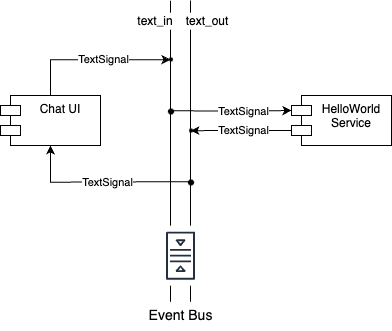

# Template repository for a minimal App

## Applicaton

This repository contains a minimal "Hello World" application using the Leolani framework. It consists of a browser based
Chat UI for text in- and output and a simple processing component that answers to text input with a "Hello world!" message.
The diagram below visualizes the event flow in the application.

## Quick start

To run the simple Hello World! application
- clone this repository including all submodules with

      git clone --recurse-submodules https://github.com/leolani/cltl-template-app.git <YOUR FOLDER NAME>

- run `make build` from the root directory of the repository (twice),
- change to the *app/* directory and activate the virutal environment created by the previous step with

      source venv/bin/activate

- change to the *app/py-app/* directory and run the application with

      python app.py

- open the [Chat UI](http://localhost:8000/chatui/static/chat.html) in your browser which is served under
  http://localhost:8000/chatui/static/chat.html, and start a chat. The application should respond with simple
  *Hallo world!* messages repeating your input.

## Applicaton structure

The application is structured as follows:

- **Existing components** are included as Git submodules in the repository. These are
  * _cltl-chat-ui/_ the graphical user interface for having a chat dialogue,
  * _cltl-combot/_ shared code and representations,
  * _cltl-emissor-data/_ recording interaction data in EMISSOR format,
  * _emissor/_ EMISSOR library
- **Requirements** of the application are centraly defined in _cltl-requirements/_
- **Build utilities** to build the application are contained in _util/_
- **Application specific code** is contained in _app/_
  - _src/_ contains additional source code
  - _py-app/_ contains the main Python application
  - _py-app/config/_ contains configuration for the main application
  - _py-app/storage/_ contains stored interaction and application data

In this setup, all components are run in a single Python app, namely *app/py-app/app.py*. To set up a
virtual environment for this application we provide build tooling which creates a virtual environment
in *app/venv* that contains all the necessary dependencies by building and installing Python packages
for all included components and external dependencies. This can be done by running

    make build

in the root of the repository.

## EMISSOR

The application collects interaction data in [EMISSOR](https://github.com/leolani/emissor) format.
There is a single scenario created in *app/py-app/storage/emissor* for each run of the application.

## Build your own application

### Setup the application

1. Clone this repository.

       git clone --recurse-submodules https://github.com/leolani/cltl-template-app.git <YOUR FOLDER NAME>

1. Change the *origin* to your own online *git* repository:

       git remote set-url origin <YOUR REPOSITORY URL>
       git push -u origin main

1. Add custom components and code in *src/* or add them as *git* submodule as described below.

### Adding components

1. Add the component as *git* submodule, e.g *cltl-eliza*:

       git submodule add -b main --name cltl-eliza https://github.com/leolani/cltl-eliza.git cltl-eliza
       git submodule update --init --recursive

1. Add the component to
    - *makefile*: Add the folder name of the component to the *project_components* list, e.g. `cltl-eliza`.
    - *app/makefile*: Add the folder name of the component to the *project_dependencies* list, e.g. `cltl-eliza`.
    - *app/requirements.txt*: Add it with the package name and eventual
      [optional depencdenies](https://setuptools.pypa.io/en/latest/userguide/dependency_management.html#optional-dependencies)
      (see the *setup.py* of the component), e.g. `cltl.eliza[service]`.
    - Rebuild the components running `make build` from the root directory of the repository.

1. Setup and start the component in *app/py-app/app.py*. For convenience follow
   the pattern to create a *Container* and add it to the ApplicationContaienr, see e.g. the `ElizaContainer` in
   [Leolani app](https://github.com/leolani/eliza-app/blob/main/app/py-app/app.py)). Don't forget to add the
   necessary imports. For the Eliza component this would include:
   - Create an instance of `cltl.eliza.eliza.ElizaImpl`,
   - create an instance of `cltl_service.eliza.service.ElizaService` using the configuration and the `ElizaImpl`
     instance created in the previous step,
   - start and stop the service at application start and termination.
1. If the service of the component provides REST endpoints via a Flask app, add it in the `main()` function of
   *app/py-app/app.py*.
1. Add the necessary configuration section(s) in *app/py-app/config/default.config* (see the documentation of the
   component or e.g.
   the [Leolani app](https://github.com/leolani/cltl-leolani-app/blob/main/py-app/config/default.config)). For the
   Eliza component this would be:

       [cltl.eliza]
       language: en
       topic_input : cltl.topic.text_in
       topic_output : cltl.topic.text_out
       intentions:
       topic_intention:
       topic_desire:

1. In the configuration, connect the input and output of the component to existing components by configuring the desired
   topic names, e.g. for Eliza by setting _topic_input_ to the same value as _topic_utterance_ in the Chat UI configuration
   (i.e. `cltl.topic.text_in`) and _topic_input_ to the value of _topic_response_ in the Chat UI configuration
   (`cltl.topic.text_out`).
1. Add required dependencies of the component to *cltl-requirements/requirements.txt* (see the documentation or
   *setup.py* of the added component), e.g. none for Eliza.
1. Remove the Hello World example by removing the DemoContainer from the ApplicationContainer in *app/py-app/app.py*.
1. Rebuild the components running `make build` from the root directory of the repository and restart the application.